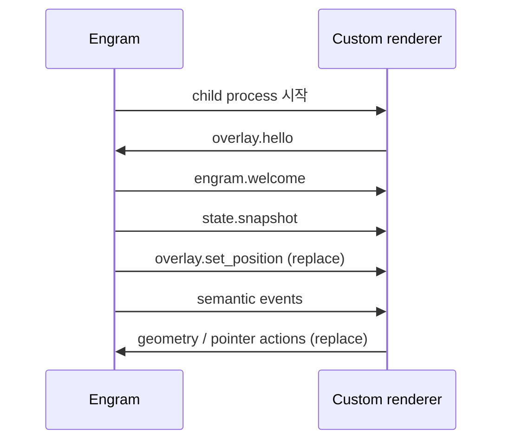

# Engram External Overlay Event API v1

> renderer는 stdout으로 Engram에 메시지를 보내고, stdin으로 Engram 이벤트를 받는다. stdout에는 JSONL 프로토콜만 쓰고 로그는 stderr로 보낸다.

## 시작 순서



renderer가 시작되면 2초 안에 아래 메시지를 stdout 첫 줄로 보내야 한다.

```json
{"schema_version":1,"type":"overlay.hello","payload":{"supported_schema_versions":[1]}}
```

Engram은 성공한 handshake 뒤 `engram.welcome`과 `state.snapshot`을 보낸다.
알 수 없는 필드나 이벤트 type은 오류 없이 무시해야 한다.

## Engram에서 받는 메시지

| type | display hint | 공개 payload |
| --- | --- | --- |
| `conversation.input_active` | `input` | `{}` |
| `conversation.input_idle` | `idle` | `{}` |
| `conversation.input_submitted` | `input` | `{}` |
| `generation.started` | `generating` | `{}` |
| `generation.thinking` | `thought` | `{}` |
| `tool.started` | `search`, `memory`, `generating` | `{category}` |
| `tool.completed` | `generating` | `{}` |
| `tool.failed` | `error` | `{}` |
| `generation.completed` | `success` | `{outcome: success}` |
| `provider.failed` | `provider_error` | `{}` |
| `overlay.set_position` | 없음 | `{x, y}` |

`conversation.input_active`는 입력창을 열거나 포커스한 것만으로는 발생하지 않는다. 출력 가능한 문자·Backspace/Delete·커서 이동 같은 실제 편집 키 입력에서 시작하며, 마지막 해당 키 입력 후 700ms 동안 추가 입력이 없거나 포커스 이탈·숨김·취소·제출 시 `conversation.input_idle`로 끝난다. 두 이벤트는 입력 원문이나 키 값을 포함하지 않는 metadata-only 신호다. Return/Escape와 modifier-only 입력은 활동을 시작하지 않으며, `conversation.input_submitted`은 실제 제출을 나타내는 별도 이벤트로 유지된다.

의미 이벤트 envelope은 `schema_version`, `id`, `sequence`, `timestamp`, `type`,
`display_hint`, `payload`를 포함한다. 지원 hint는 `default`, `idle`, `hover`, `click`,
`input`, `generating`, `search`, `thought`, `memory`, `success`, `provider_error`, `error`다.

도구 이름 자체는 전달되지 않고 `memory`, `search`, `read`, `write`, `execute`,
`communication`, `other` 범주 중 하나만 공개된다.

## Engram으로 보내는 메시지

`observer`는 hello 외 메시지가 없어도 된다. interactive observer는 실제 창 위치/크기와
`left_click`을 보내면 Engram의 기존 bubble session을 그 창에 앵커할 수 있다. 이 geometry는
Engram의 번들 창 위치를 바꾸거나 저장하지 않는다. `replace`는 실제 창 위치와 크기를 보고하고
포인터 입력을 Engram 공통 동작으로 전달해야 한다.

```json
{"schema_version":1,"type":"overlay.geometry_changed","payload":{"x":120,"y":80,"width":320,"height":480}}
{"schema_version":1,"type":"pointer.action","payload":{"action":"left_click"}}
{"schema_version":1,"type":"pointer.action","payload":{"action":"drag_move","screen_x":240,"screen_y":160}}
```

| action | 좌표 요구 | 의미 |
| --- | --- | --- |
| `left_click` | 없음 | Engram 채팅 열기/닫기 |
| `right_click` | `screen_x`, `screen_y` | Engram 공통 메뉴 |
| `pointer_enter` / `pointer_leave` | 없음 | hover 상태 |
| `drag_move` / `drag_end` | `screen_x`, `screen_y` | 창 좌상단 좌표. replace는 Engram 소유 위치 갱신, observer는 로컬 이동 후 geometry 재보고 |
| `drag_begin` | 없음 | v1 예약/no-op |

`drag_move`와 `drag_end`의 필드명은 `screen_x`, `screen_y`지만 커서 좌표가 아니다.
드래그 시작 시의 커서-창 오프셋을 유지해 계산한 **창 좌상단의 절대 화면 좌표**를 보낸다.
커서 좌표를 그대로 보내면 Engram의 `overlay.set_position` 응답이 창을 커서 위치로 되돌려
오프셋과 플리커가 발생한다.

## Manifest

설치 위치는 `%USERPROFILE%/.engram/overlays/<id>/manifest.yaml`이다.

```yaml
schema_version: 1
id: engram-custom
name: Engram Custom Overlay
command: ["renderer.exe", "--engram-jsonl"]
supported_modes: [observer, replace]
```

`id`는 디렉터리명과 같아야 한다. `command`는 shell 문자열이 아닌 빈 값 없는 argv 배열이다.
상대 실행 파일은 manifest 디렉터리 안에 있어야 한다. 설정 저장 뒤에는 overlay 재시작이 필요하다.

## 개인정보와 복구 경계

v1은 `metadata_only`다. 사용자 입력, 모델 응답과 thinking 원문, 도구 입력·출력,
파일 경로, 메모리 본문을 renderer에 전달하지 않는다. hello timeout, 잘못된 JSONL,
쓰기 실패, child 종료가 발생하면 Engram은 번들 renderer를 유지하거나 복구한다.
